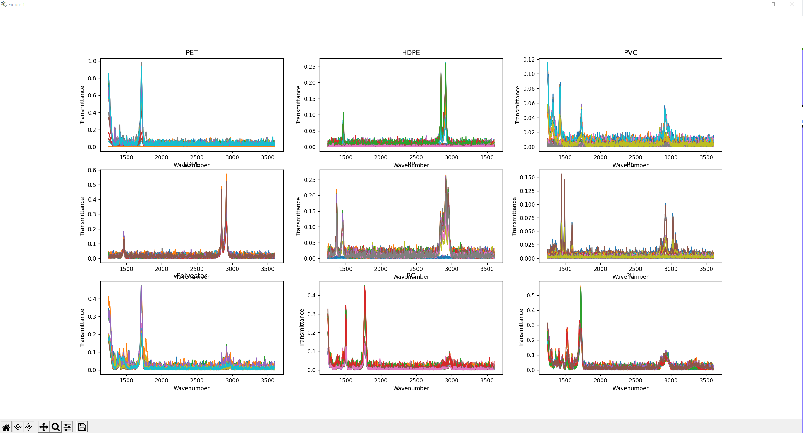
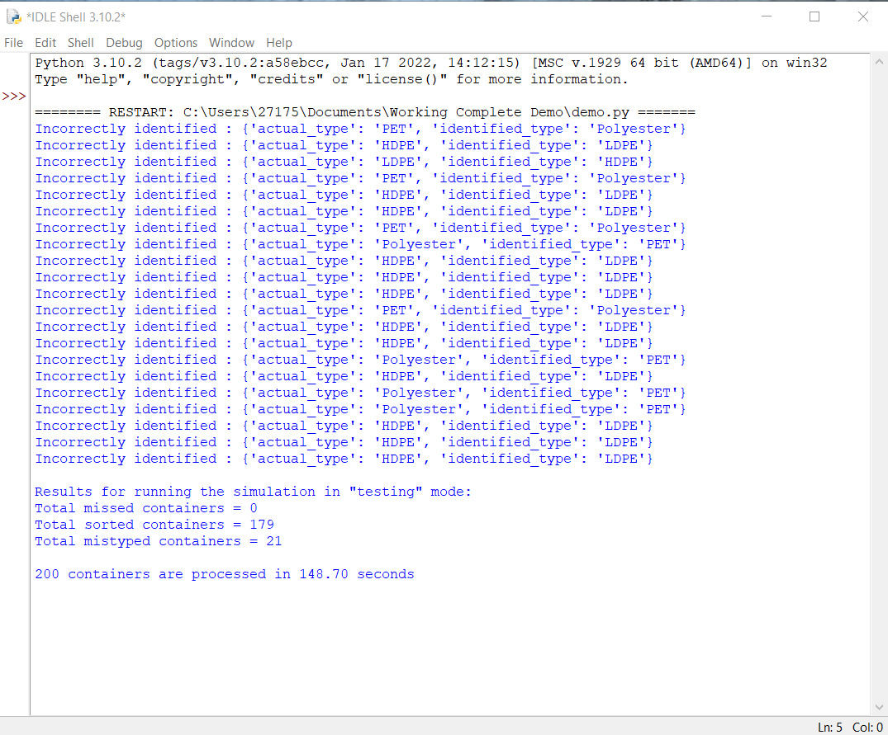

# Recycle Sorting
Solid waste recycling is crucial to maintaining a sustainable future since it reduces power consumption while also conserving natural resources by decreasing the use of raw materials.

## Background Information
The input parameter to the recycling plant will be mixed waste. Statistics from suggest that McMaster produces about 616kg of waste per day. The recycling plant should expect to receive a fraction of that waste depending on the size of the plant design as some will be sent to other recycling facilities and landfills instead. Our plant should expect a waste composition similar to the sample found from, 39.8% non-recyclables, 21.5% organic waste, 13.2% mixed papers, 12.3% mixed containers, 5.9% coffee cups, 5.5% paper towels, 1.6% cardboard, and 0.1% Styrofoam. 

The output of the recycling plant will be separated streams of waste. These streams include refuse (waste going to landfills), reusable plastics, papers, metals, and glasses. They will all be distinct and sorted accurately so that they can go to the appropriate location for further processing once it leaves the McMaster plant. Statistics from indicated that in 2019, about 1244 tonnes of waste material was diverted from landfills because of the recycling program at McMaster. Our plant design should be expected to output a daily value (appropriate to its size) that will match this level or even go beyond it. 

## Pre-Requirements
pandas ```pip install pandas``` <br />
numpy ```pip install numpy``` <br />
pprint ```pip install pprint``` <br />
matplotlib ```pip install matplotlib``` <br />
rcpalnt ```pip install rcplant``` 

## Use - Short description
The purpose of this project is to sort 7 different types of plastics based on their readings' characteristics including HDPE, LDPE, PP, PS, PC, PVC, Polyester, PET and PU.

## Variables

#### simulation parameters

    conveyor_length = 1000  # cm
    conveyor_width = 100  # cm
    conveyor_speed = 35  # cm per second (Faster Convey belt speed will cuase sensor to miss container)
    num_containers = 200
    sensing_zone_location_1 = 500  # cm
    sensors_sampling_frequency = 5  # Hz (Higher Frequenc will casue more singal noise)
    simulation_mode = 'testing' #testing generates singal noise
    sensors = [Sensor.create(SpectrumType.FTIR, sensing_zone_location_1),] #could use Raman
    conveyor = Conveyor.create(conveyor_speed, conveyor_length, conveyor_width)
    
    simulator = RPSimulation(
        sorting_function=user_sorting_function,
        num_containers=num_containers,
        sensors=sensors,
        sampling_frequency=sensors_sampling_frequency,
        conveyor=conveyor,
        mode=simulation_mode
    )
    
    elapsed_time = simulator.run() #estimate time
    
    spectrum = sensors_output[sensor_id]['spectrum'] #create new sensor
    
## Ploted Data
    plt.figure()
    todo #inside plot demo in insrtuctions folder
    plt.show()
#### Example of plot
Data plotted after running through 200 examples


#### Result

